

# AzkCore Tech System

System page oficial de <strong>AzkCore Tech</strong> desarrollada con <strong>Django </strong>.

Proyecto enfocado en presentar servicios de <strong>ciberseguridad</strong>, incluyendo auditorías web, pentesting, análisis de vulnerabilidades y consultoría de seguridad informática para usuarios, profesionales y pequeñas empresas.

 

## Tecnologías utilizadas

 
 

##  Screenshots

| Landing Page | Landing Page |
|:---:|:---:|
| 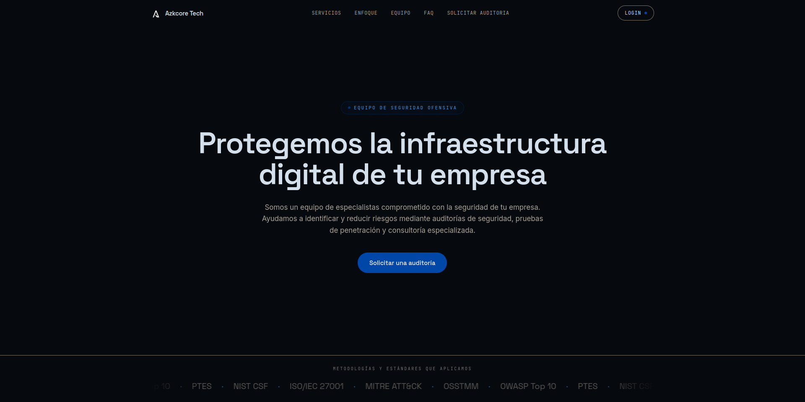 | 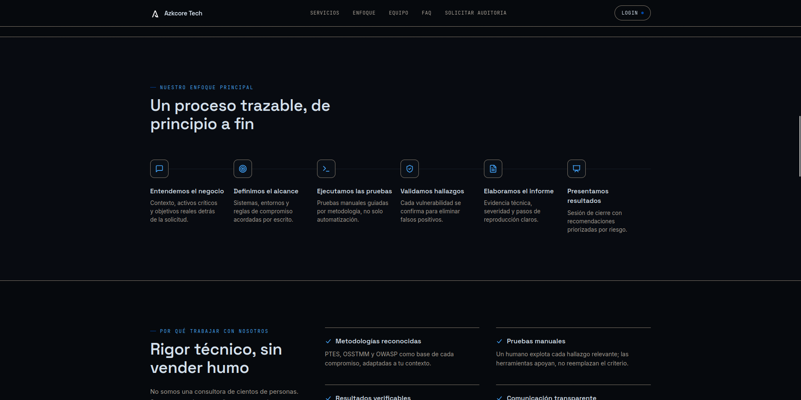 |

| Login | Formulario Contacto |
|:---:|:---:|
| 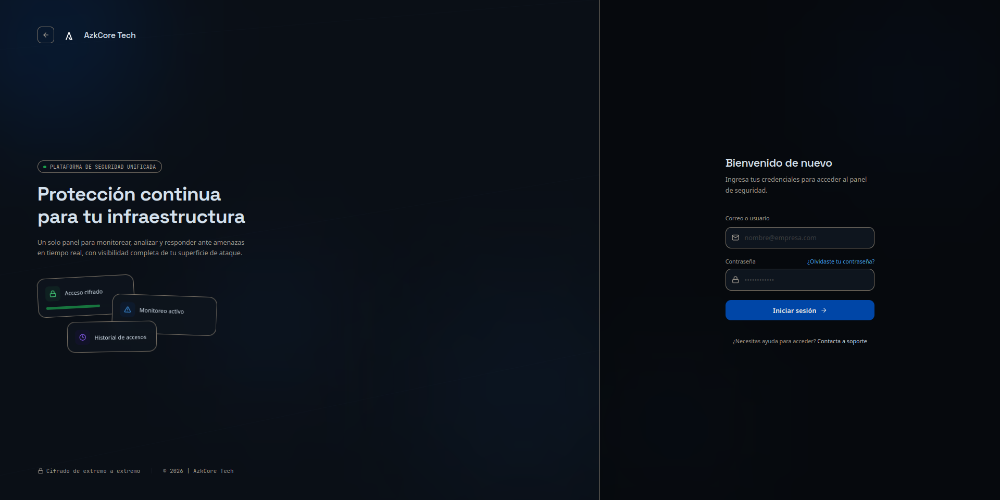 | 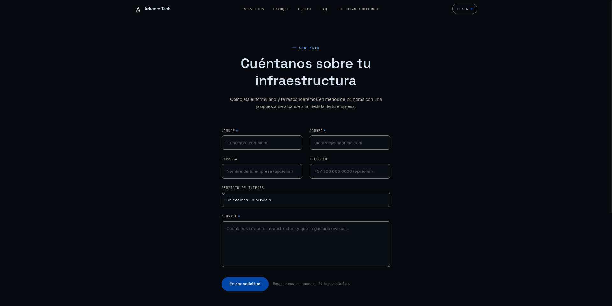 |

| Dashboard | Escaneo de Red |
|:---:|:---:|
| 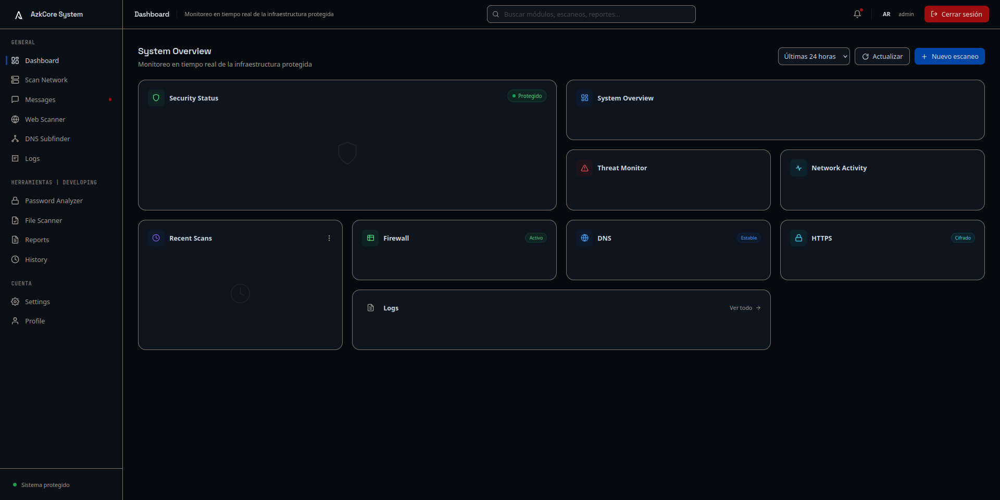 | 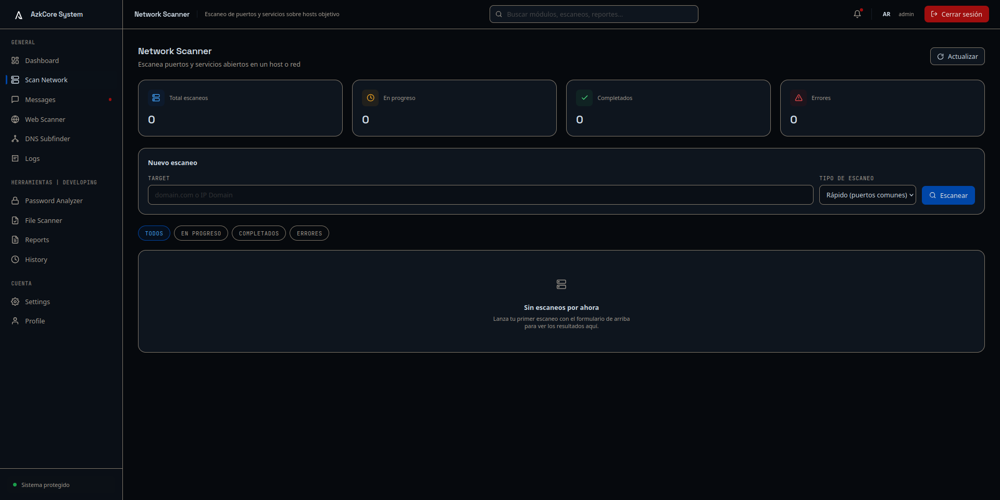 |

| Escaneo Web | Perfil |
|:---:|:---:|
| 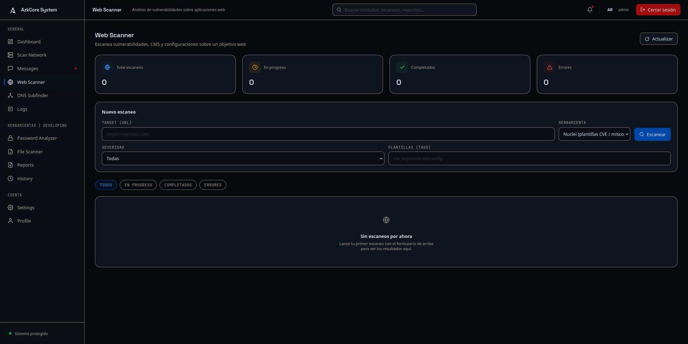 | 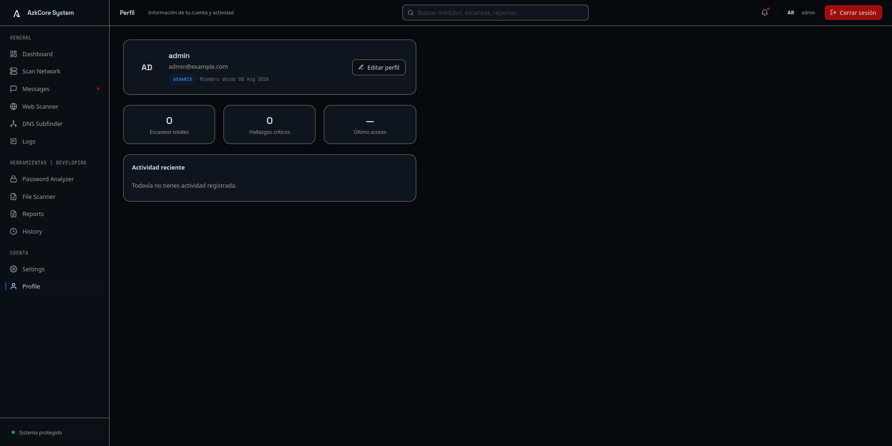 |

| Configuración | Mensajes |
|:---:|:---:|
| 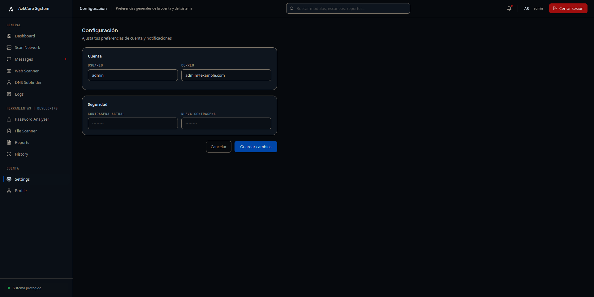 | 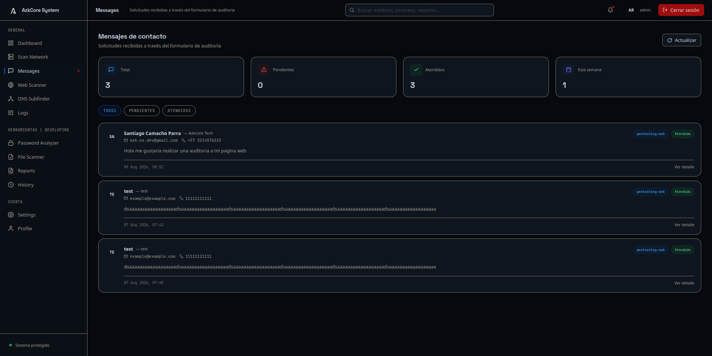 |

| DNS Subfinder | Logs |
|:---:|:---:|
| 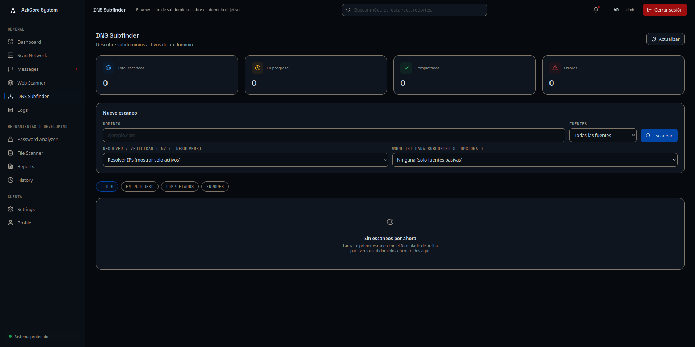 | 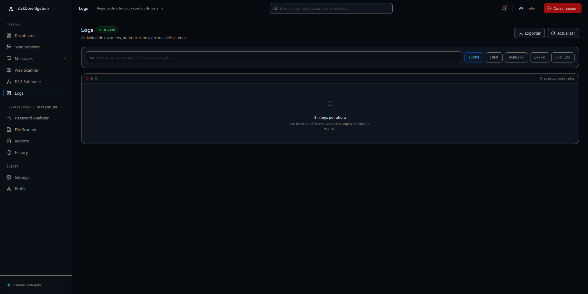 |

 

---

**AzkCore Tech**
Security • Technology • Innovation

